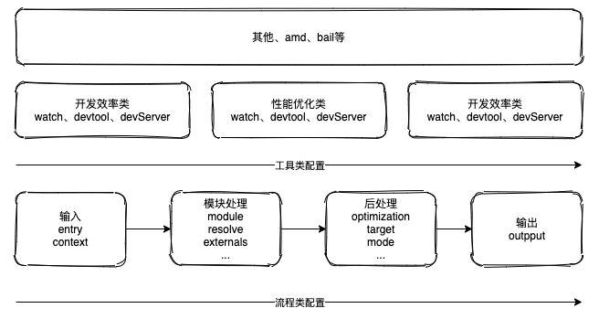

# Webpack

Webpack 则忽略具体资源类型之间的差异，将所有代码/非代码文件都统一看作 Module —— 模块对象，以相同的加载、解析、依赖管理、优化、合并流程实现打包，并借助 Loader、Plugin 两种开放接口将资源差异处理逻辑转交由社区实现，实现统一资源构建模型，这种设计有很多优点：

- 所有资源都是 Module，所以可以用同一套代码实现诸多特性，包括：代码压缩、Hot Module Replacement、缓存等
- 打包时，资源与资源之间非常容易实现信息互换，例如可以轻易在 HTML 插入 Base64 格式的图片
- 借助 Loader，Webpack 几乎可以用任意方式处理任意类型的资源，例如可以用 Less、Stylus、Sass 等预编译 CSS 代码

Webpack 具有极强的开放性，也让它得以成为前端工程化环境的 基座，我们可以围绕 Webpack 轻易接入一系列工程化工具，例如 TypeScript、Babel 一类的 JavaScript 编译工具；或者 Less、Sass、Stylus、PostCSS 等 CSS 预处理器；或者 Jest、Karma 等测试框架，等等

这些工具都不同程度上补充了 Webpack 不同方面的工程化能力，使得它能够成为一个大一统的资源处理框架，满足现代 Web 工程在效率、质量、性能等方面的诉求，甚至能够应对小程序、微前端、SSR、SSG、桌面应用程序、NPM 包等诸多应用场景。也因此，即使在当下百花齐放的 Web 工程化领域中，Webpack 依然是最为广泛使用的构建工具之一

如今的 Webpack 已经非常非常成熟，在基础构建能力之外还提供了诸多锦上添花的工程化工具，包括：

- 基于 Module Federation 的微前端方案
- 基于 webpack-dev-server 的 Hot Module Replacement
- 基于 Terser、Tree-shaking、SplitChunks 等工具的 JavaScript 代码压缩、优化、混淆方案
- 基于 lazyCompilation 的延迟编译功能
- 有利于提升应用性能的异步模块加载能力
- 有利于提升构建性能的持久化缓存能力
- 内置 JavaScript、JSON、二进制资源解析、生成能力
- ……

如今，Webpack 已经发展的几乎无所不能，但代价则是上手学习成本非常高，学习曲线非常陡峭

这一方面是因为 Webpack 确实是一个极度复杂的构建系统，应用层面、实现层面都有非常多不明觉厉的名词、概念、逻辑模型。另一方面是缺少特别优质的学习资料，Webpack 官方虽然也提供了许多说明文档，但基本上都停留在应用层面；国内外社区也有一些优质文章、视频教程，但数量偏少，缺乏体系化与深度

在 Webpack 之后出现的许多新打包工具，例如 Rollup、Parcel、Snowpack 等，都或多或少受它影响

归根结底，那些所谓的新技术，核心和本质的东西其实就是当初学的那些知识。所以说，基础知识就像是一座大楼的地基，它决定了我们的技术高度。而要想快速做出点事情，前提条件一定是基础能力过硬

思想到位了，基础够扎实，学东西才会快，因为到最后可能会发现，万变不离其宗

## webpack 配置项

Webpack 原生提供了上百种配置项，这些配置最终都会作用于 Webpack 打包过程的不同阶段

webppack 的打包非常复杂，但是大致可分为四步：

- 输入：从文件系统读入代码文件
- 模块递归处理：调用 Loader 转译 Module 内容，并将结果转换为 AST，从中分析出模块依赖关系，进一步递归调用模块处理过程，直到所有依赖文件都处理完毕
- 后处理：所有模块递归处理完毕后开始执行后处理，包括模块合并、注入运行时、产物优化等，最终输出 Chunk 集合
- 输出：将 Chunk 写出到外部文件系统；

从上述打包流程角度，Webpack 配置项大体上可分为两类：

- 流程类：作用于打包流程某个或若干个环节，直接影响编译打包效果的配置项
- 工具类：打包主流程之外，提供更多工程化工具的配置项

### 与打包流程强相关的配置项有：

- 输入输出：
  - entry：用于定义项目入口文件，Webpack 会从这些入口文件开始按图索骥找出所有项目文件；
  - context：项目执行上下文路径；
- output：配置产物输出路径、名称等；
- 模块处理：
  - resolve：用于配置模块路径解析规则，可用于帮助 Webpack 更精确、高效地找到指定模块
  - module：用于配置模块加载规则，例如针对什么类型的资源需要使用哪些 Loader 进行处理
  - externals：用于声明外部资源，Webpack 会直接忽略这部分资源，跳过这些资源的解析、打包操作
- 后处理：
  - optimization：用于控制如何优化产物包体积，内置 Dead Code Elimination、Scope Hoisting、代码混淆、代码压缩等功能
  - target：用于配置编译产物的目标运行环境，支持 web、node、electron 等值，不同值最终产物会有所差异
  - mode：编译模式短语，支持 development、production 等值，可以理解为一种声明环境的短语

这里的重点是，Webpack 首先需要根据输入配置 (entry/context) 找到项目入口文件；之后根据按模块处理 (module/resolve/externals 等) 所配置的规则逐一处理模块文件，处理过程包括转译、依赖分析等；模块处理完毕后，最后再根据后处理相关配置项 (optimization/target 等) 合并模块资源、注入运行时依赖、优化产物结构等

这些配置项与打包流程强相关，建议学习时多关注它们对主流程的影响，例如 entry 决定了项目入口，而 output 则决定产物最终往哪里输出；resolve 决定了怎么找到模块，而 module 决定了如何解读模块内容，等等。

### 与工具类强相关的配置项：

除了核心的打包功能之外，Webpack 还提供了一系列用于提升研发效率的工具，大体上可划分为：

- 开发效率类：
  - watch：用于配置持续监听文件变化，持续构建
  - devtool：用于配置产物 Sourcemap 生成规则
  - devServer：用于配置与 HMR 强相关的开发服务器功能
- 性能优化类：
  - cache：Webpack 5 之后，该项用于控制如何缓存编译过程信息与编译结果
  - performance：用于配置当产物大小超过阈值时，如何通知开发者
- 日志类：
  - stats：用于精确地控制编译过程的日志内容，在做比较细致的性能调试时非常有用
  - infrastructureLogging：用于控制日志输出方式，例如可以通过该配置将日志输出到磁盘文件
- 等等

逻辑上，每一个工具类配置都在主流程之外提供额外的工程化能力，例如 devtool 用于配置产物 Sourcemap 生成规则，与 Sourcemap 强相关；devServer 用于配置与 HMR 相关的开发服务器功能；watch 用于实现持续监听、构建。

工具类配置内聚性较强，通常一个配置项专注于解决一类工程问题，配置项按其功能简单分类如下：



虽然 Webpack 提供了上百项复杂配置，但大体上都可以归类为流程类配置或工具类配置，对于流程类配置应该多关注它们对编译主流程的影响；而工具类则更加内聚，基本上一种配置项解决一种工程化问题。

除了上面提到的属性外，Webpack 还提供了诸如 amd、bail、dependencies 等配置项，但使用频率较低

### 配置逻辑综合解析

```
├── src
|   └── index.js
└── webpack.config.js
```

其中，src/index.js 为项目入口文件，webpack.config.js 为 Webpack 配置文件。在配置文件中，首先我们需要声明项目入口：

```js
// webpack.config.js
module.exports = {
  entry: "./src/index",
};
```

之后，还需要声明产物输出路径：

```js
const path = require("path");

module.exports = {
  entry: "./src/index",
  output: {
    filename: "[name].js",
    path: path.join(__dirname, "./dist"),
  },
};
```

至此，已经足够驱动一个最简单项目的编译工作。但是，在前端项目中经常需要处理 JS 之外的其它资源，包括 css、ts、图片等，此时需要为这些资源配置适当的加载器

```js
const path = require("path");

module.exports = {
  entry: "./src/index",
  output: {
    filename: "[name].js",
    path: path.join(__dirname, "./dist"),
  },
  module: {
    rules: [
      {
        test: /\.less$/i,
        include: {
          and: [path.join(__dirname, "./src/")],
        },
        use: [
          "style-loader",
          "css-loader",
          {
            loader: "less-loader",
          },
        ],
      },
    ],
  },
};
```

到这里已经是一个简单但足够完备的配置结构了，接下来还可以根据需要使用其它工程化工具，例如使用 devtool 生成 Sourcemap 文件；使用 watch 持续监听文件变化并随之重新构建

## 脚手架工具

上述概览只是对从流程角度对 Webpack 配置项做了一个简单的分类总结，实际应用中往往需要牵涉更多 Loader、Plugin，加之性能、效率方面的考虑，配置复杂度往往会随项目推进而极速膨胀，届时配置管理会变得比较困难。为此，社区提供了许多用于快捷管理配置的工具，包括：

- Vue CLI：用于帮助用户快速创建、运行 Vue.js 项目脚手架的命令行工具；
- create-react-app：用于创建 React 项目脚手架的命令行工具；
- @angular/cli：用于创建 angular 项目的命令行工具；
- webpack-cli：Webpack 官方提供的命令行工具，提供了一套交互式生成配置文件的指令集，以及项目编译、开发、迁移等功能；
- Neutrino：用于快速创建、运行现代 JavaScript 应用的工具，同时支持 React、Preact、Vue、Web、Node.js、Library 等场景；
- react-starter-kit：用于创建 React + Relay + GraphQL 应用的脚手架工具，内置 SSR 支持。

这些工具都内置了许多开箱即用的工程化能力，开发者无需从 0 开始学习 Webpack 与各种工程化组件，就可以直接使用工具一键生成足够应对中小型项目需求的工程化环境

### Vue CLI

Vue CLI 全称 Vue.js Command-Line Interface，是由 Vue 核心团队开发，用于帮助用户快速创建、运行 Vue.js 项目脚手架的命令行工具。实现上，Vue CLI 底层调用 Webpack 实现针对 .vue 等资源的编译打包功能；调用 webpack-dev-server 实现包含 HMR 功能的开发服务器功能；还能通过插件方式整合 ESLint、Babal、Less 等工具。

安装与使用过程不在表述

它的底层依赖于 Webpack 实现编译打包等工程化能力，开发者可通过 configureWebpack 与 chainWebpack 配置项修改 Webpack 配置信息。

以 configureWebpack 为例，使用时需要在 vue.config.js 文件中写入配置：

```js
// vue.config.js
module.exports = {
  configureWebpack: {
    plugins: [new MyAwesomeWebpackPlugin()],
  },
};
```

configureWebpack 的配置规则与 Webpack 一致，同样支持 plugins/module/resolve 等配置项。实际上，Vue CLI 内部最终会调用 webpack-merge 将 configureWebpack 值与其它上下文配置合并，生成最终的 Webpack 配置信息。

chainWebpack 的用法与 configureWebpack 一致，区别仅在于此处支持 webpack-chain 语法 —— 即以函数方式链式修改 Webpack 配置：

```js
module.exports = {
  chainWebpack: (config) => {
    config.module
      .rule("vue")
      .use("vue-loader")
      .tap((options) => {
        // 改动options操作
        return options;
      });
  },
};
```

Vue CLI 在 Webpack 基础上包装多一层更易用的功能结构，这确实能极速提升研发效率与体验，但代价则是我们完全不清楚其内部运作细节，这会导致开发者比较难做一些深度定制或者性能优化，此时可使用 inspect 命令生成完整的 Webpack 配置信息：

```
vue inspect > output.js
```

外，inspect 还提供许多根据不同条件生成配置的参数，例如针对编译环境生成配置：

```
vue inspect --mode production > output.prod.js
```

更多用法，可查阅帮助文档：

```
vue inspect --help
```

### 使用 CRA 搭建项目脚手架

CRA 全称 Create React Application，同样是用于帮助用户快速创建、运行 React 项目脚手架的命令行工具，功能、底层实现、用法都与 Vue CLI 相似，都提供了全套开箱即用的 React 项目开发、调试环境。

CRA 用法同样简单：

```
npx create-react-app my-app
```

执行完毕后，生成项目文件：

```

my-app
├── README.md
├── node_modules
├── package.json
├── .gitignore
├── public
│   ├── favicon.ico
│   ├── index.html
│   └── manifest.json
└── src
    ├── App.css
    ├── App.js
    ├── App.test.js
    ├── index.css
    ├── index.js
    ├── logo.svg
    └── serviceWorker.js
    └── setupTests.js
```

> [官网](https://github.com/facebook/create-react-app)

默认规则创建的脚手架包含如下工程能力：

- JSX、ES6、TypeScript、Flow 语法支持
- CSS 自动添加 --webkit-- 前缀
- 基于 Jest 的自动化测试能力
- 支持 HMR 的开发服务器
- 等等

必要时，读者也可以通过 npm run eject 命令导出完整的项目配置结构，会展示内置 webpack 配置，可进行自定义开发，直接修改 webpack.config.js 等相关配置文件即可控制各项功能行为。但是要注意，此过程不可逆。即展示配置项后，不可再隐藏

```
my-app
├─ .gitignore
├─ README.md
├─ config
│  ├─ env.js
│  ├─ getHttpsConfig.js
│  ├─ jest
│  │  ├─ babelTransform.js
│  │  ├─ cssTransform.js
│  │  └─ fileTransform.js
│  ├─ modules.js
│  ├─ paths.js
│  ├─ webpack
│  │  └─ persistentCache
│  │     └─ createEnvironmentHash.js
│  ├─ webpack.config.js
│  └─ webpackDevServer.config.js
├─ package-lock.json
├─ package.json
├─ node_modules
├─ ...
└─ src
   ├─ ...
```
